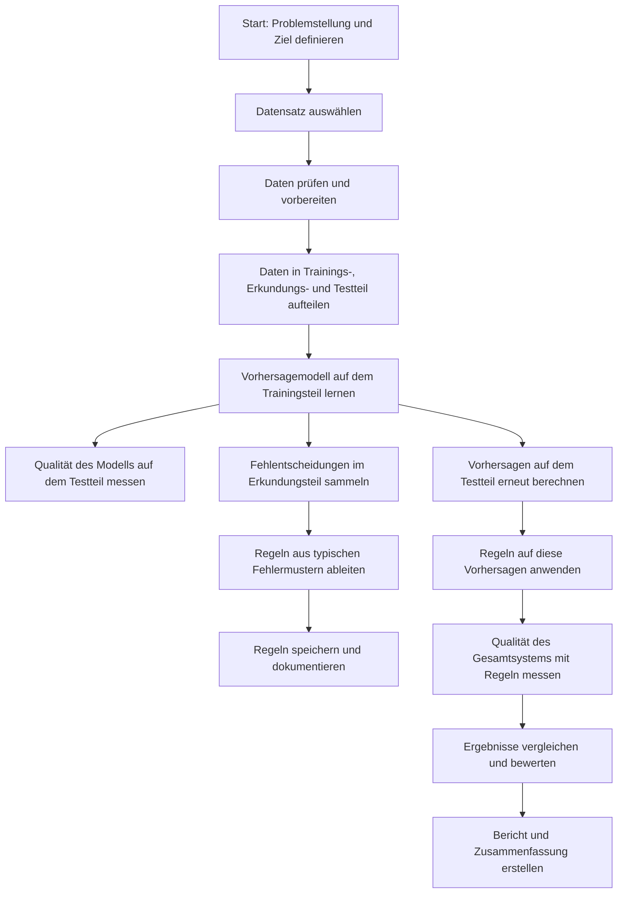
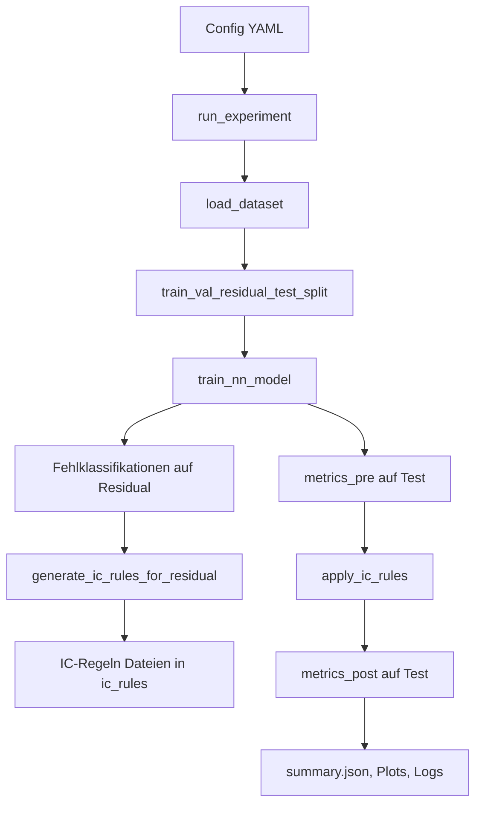
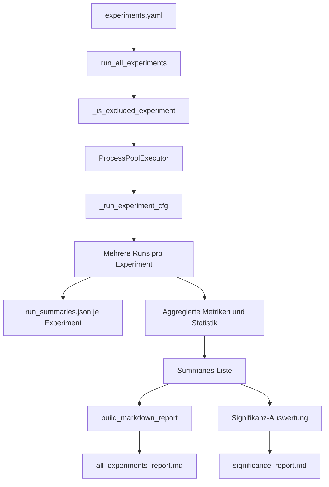
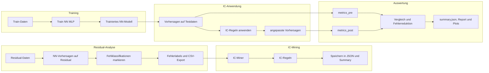

# NNIC Eval – Neuronale Netze mit Integrity Constraints

Dieses Repository enthält eine Referenzimplementierung von **NNIC (Neural Networks with Integrity Constraints)** zur Evaluation auf verschiedenen Klassifikationsdatensätzen. 

Der Code bildet den kompletten Workflow ab:

- **Daten laden und splitten** in `train`, `residual`, `test` (optional `val`).
- **Training eines neuronalen Netzes (MLP)** als Basismodell.
- **Identifikation von Fehlklassifikationen** und Mining von **Integrity-Constraint-Regeln (ICs)** aus diesen Fehlern.
- **Anwendung der IC-Regeln** zur Markierung oder Korrektur von NN-Vorhersagen.
- **Auswertung** (Pre/Post-IC-Metriken, Fehlerraten, Green-AI-indikative Größen, Baseline-Vergleiche).
- **Batch-Experimente** über viele Datensätze und Splits inkl. Markdown-Report und Signifikanzauswertung.

---

## Inhalt

- [Voraussetzungen & Installation](#voraussetzungen--installation)
- [Projektstruktur](#projektstruktur)
- [Verwendete Datensätze](#verwendete-datensätze)
  - [Sklearn-/UCI-Datensätze](#sklearn-uci-datensätze)
  - [OpenML-Datensätze](#openml-datensätze)
- [Experimentkonfiguration](#experimentkonfiguration)
- [Prozessüberblick](#prozessüberblick)
  - [High-Level-Pipeline (einzelnes Experiment)](#high-level-pipeline-einzelnes-experiment)
  - [Batch-Experimente & Reporting](#batch-experimente--reporting)
- [Ausgabeartefakte & Reports](#ausgabeartefakte--reports)
- [Reproduzierbarkeit & Statistik](#reproduzierbarkeit--statistik)

---

## Voraussetzungen & Installation

- Python (Version gemäß `requirements.txt`, z.B. 3.10+)
- Virtuelle Umgebung empfohlen

```bash
# (optional) virtuelle Umgebung anlegen
python -m venv .venv
source .venv/bin/activate  # unter Windows: .venv\Scripts\activate

# Abhängigkeiten installieren
pip install -r requirements.txt
```

---

## Projektstruktur

Wichtige Verzeichnisse und Dateien:

- **`src/nnic/`** – Hauptcode
  - **`data/datasets.py`** – Laden der Datensätze (sklearn & OpenML, plus CSV-Option).
  - **`data/splitting.py`** – Erzeugung der Splits `train`, `residual`, `test` (und optional `val`).
  - **`models/nn_models.py`** – MLP-Architekturen.
  - **`training/nn_trainer.py`** – Training des NN inkl. Trainingshistorie.
  - **`misclassification/`** – Extraktion und Export von Fehlklassifikationen.
  - **`ic_generation/`** – Mining von IC-Regeln (Random Forest / Clustering) aus Fehlerregionen.
  - **`ic_application/`** – Anwendung der IC-Regeln (Flagging vs. Correction).
  - **`evaluation/metrics.py`** – Standardklassifikationsmetriken.
  - **`baselines/rf_baseline.py`** – Random-Forest-Baseline.
  - **`experiment/runner.py`** – Ausführung eines einzelnen Experiments auf Basis einer Config.
  - **`experiment/hpo.py`** – Grid-Search über Hyperparameter (auf Val-Metrik).
  - **`experiment/utils.py`** – Seed-Handling, Output-Verzeichnisse.
  - **`reporting/report_builder.py`** – Generierung des Markdown-Reports über alle Experimente.
- **`configs/`** – YAML-Konfigurationen
  - `experiments.yaml` – Masterliste aller Experimente (Datensatz, Splits, Modell, IC-Einstellungen, etc.).
  - weitere Beispiel-Configs pro Datensatz/Split.
- **`run_experiment.py`** – Führt ein einzelnes Experiment aus (Config-Pfad als Argument).
- **`run_all_experiments.py`** – Führt alle in `experiments.yaml` definierten Experimente als Batch aus.
- **`start_nnic.sh`** – Komfortskript zum Starten der Batch-Experimente.
- **Ergebnisordner (werden automatisch erzeugt):**
  - `results/` – Metriken, Summaries, Run-Statistiken.
  - `plots/` – Plots für Akkuratheit, Fehler, IC-Effekt, Baumvisualisierungen.
  - `ic_rules/` – JSON-Repräsentation und textuelle Summary der generierten IC-Regeln.
  - `logs/` – Trainingshistorien u.Ä.

---

## Verwendete Datensätze

Die Datensätze werden in `src/nnic/data/datasets.py` geladen und in `configs/experiments.yaml` experiment-spezifisch konfiguriert.

### Sklearn-/UCI-Datensätze

Diese Datensätze werden direkt über `sklearn.datasets` geladen:

| Kurzname        | Quelle            | Datentyp                 | Bemerkung |
|-----------------|-------------------|--------------------------|-----------|
| `digits`        | `load_digits()`   | Mehrklassen-Klassifikation (Ziffern) | Klassische Zifferndaten (8x8-Pixel-Flächen als Merkmale). |
| `covertype`     | `fetch_covtype()` | Mehrklassen-Klassifikation | Forstbedeckungs-Typen aus geospatialen Merkmalen. |
| `iris`          | `load_iris()`     | Mehrklassen-Klassifikation | 3 Iris-Arten basierend auf Blütenmaßen. |
| `breast_cancer` | `load_breast_cancer()` | Binäre Klassifikation | Diagnose-Baseline (maligne/benigne). |
| `wine`          | `load_wine()`     | Mehrklassen-Klassifikation | Weinqualität anhand chemischer Merkmale. |

Für diese Datensätze verwendet der Loader jeweils Features `X` und Labels `y` und normalisiert die Labels auf `0..(K-1)`.

Die Experimente nutzen pro Datensatz drei Split-Schemata (vgl. `experiments.yaml`):

- **95% Train / 0% Residual / 5% Test**  (`test_size: 0.05`, `residual_size: 0.0`)
- **72.5% Train / 22.5% Residual / 5% Test**  (`residual_size: 0.225`)
- **47.5% Train / 47.5% Residual / 5% Test**  (`residual_size: 0.475`)

Der Test-Split (5%) wird in allen Szenarien mit identischem `random_state` gezogen und bleibt somit über Experimente hinweg fixiert.

### OpenML-Datensätze

Für generische OpenML-Datensätze verwendet der Loader `fetch_openml(..., as_frame=True)` und anschließend One-Hot-Encoding aller kategorialen Features; anschließend werden alle Spalten in numerische Features überführt.

In `experiments.yaml` sind u.a. folgende OpenML-Datensätze hinterlegt (ID gemäß OpenML):

| Name im Report       | OpenML-ID | Problemtyp                |
|----------------------|----------:|---------------------------|
| `credit-g`           | 31        | Kreditrisiko (binär)      |
| `bank-marketing`     | 1461      | Marketing-Response (binär) |
| `adult`              | 45068     | Einkommensklassifikation  |
| `spambase`           | 44        | Spam-Erkennung            |
| `phoneme`            | 1489      | Phonem-Klassifikation     |
| `nomao`              | 1486      | Binäre Klassifikation     |
| `magic-telescope`    | 1120      | Gamma-Teleskopdaten       |
| `electricity`        | 151       | Zeitreihenklassifikation  |

Die Split-Schemata entsprechen denselben 95/5-, 72.5/22.5/5- und 47.5/47.5/5-Szenarien wie bei den Sklearn-Datensätzen.

### Datensatzcharakteristika (Überblick)

**Sklearn-/UCI-Datensätze**

- **`digits`**  
  - Eingabemerkmale: Grauwert-Pixelintensitäten eines 8x8-Bildrasters (metrisch, kontinuierlich).  
  - Zielvariable: Ziffernklassen {0, …, 9} (nominal, Mehrklassen-Klassifikation).
- **`covertype`**  
  - Eingabemerkmale: Mischung aus kontinuierlichen Geländemerkmalen (Höhe, Hangneigung etc.) und kodierten kategorialen Attributen (Bodenart, Wildnisgebiet).  
  - Zielvariable: Wald-Bedeckungstyp (nominal, mehrere Klassen).
- **`iris`**  
  - Eingabemerkmale: Blütenmaße (Kelch- und Blütenblattlänge/-breite, metrisch, kontinuierlich).  
  - Zielvariable: Iris-Art (nominal, drei Klassen).
- **`breast_cancer`**  
  - Eingabemerkmale: Aus Bild-/Gewebsanalysen abgeleitete numerische Kennzahlen (metrisch, kontinuierlich).  
  - Zielvariable: Diagnose gutartig vs. bösartig (binär, nominal).
- **`wine`**  
  - Eingabemerkmale: Chemische Messwerte (z.B. Alkoholgehalt, Säurewerte, Mineralstoffe; metrisch, kontinuierlich).  
  - Zielvariable: Wein-Kategorie (nominal, Mehrklassen-Klassifikation).

**OpenML-Datensätze**

- **`credit-g` (31)**  
  - Eingabemerkmale: Kreditmerkmale wie Laufzeit, Betrag, Beschäftigungsdauer, Zahlungsverhalten (gemischte Skalen: ordinal, nominal, metrisch).  
  - Zielvariable: Kreditwürdigkeit (gut/schlecht; binär, nominal).
- **`bank-marketing` (1461)**  
  - Eingabemerkmale: Kunden- und Kampagnenmerkmale (Alter, Beruf, Kontaktkanal, frühere Kontakte etc.; numerisch und kategorial).  
  - Zielvariable: Reaktion auf eine Marketingkampagne (Antwort ja/nein; binär, nominal).
- **`adult` (45068)**  
  - Eingabemerkmale: Sozioökonomische Merkmale (Alter, Ausbildung, Beruf, Arbeitsstunden, Familienstand; numerisch und kategorial).  
  - Zielvariable: Einkommensklasse (>50K vs. ≤50K; binär, nominal).
- **`spambase` (44)**  
  - Eingabemerkmale: Häufigkeiten bestimmter Token/Zeichen in E-Mails (hauptsächlich metrische, kontinuierliche Merkmale).  
  - Zielvariable: Spam vs. Nicht-Spam (binär, nominal).
- **`phoneme` (1489)**  
  - Eingabemerkmale: Akustische Sprachmerkmale, die Phoneme charakterisieren (metrisch, kontinuierlich).  
  - Zielvariable: Phonem-Klasse (binär oder mehrstufig kodiert, nominal).
- **`nomao` (1486)**  
  - Eingabemerkmale: Mischung aus numerischen und kategorialen Merkmalen aus einem Matching-/Entscheidungskontext.  
  - Zielvariable: Binäre Entscheidungsklasse (nominal).
- **`magic-telescope` (1120)**  
  - Eingabemerkmale: Physikalische Messgrößen aus einem Cherenkov-Teleskop (metrisch, kontinuierlich).  
  - Zielvariable: Ereignisklasse (Signal vs. Hintergrund; binär, nominal).
- **`electricity` (151)**  
  - Eingabemerkmale: Zeitreihennahe Merkmale zum Elektrizitätsmarkt (z.B. Nachfrage, Preis, Richtung; teils numerisch, teils kategorial).  
  - Zielvariable: Klassenvariable zur Markt-/Preisrichtung (nominal).

#### Tabellarische Übersicht (ca. Umfang & Merkmalsanzahl)

**Sklearn-/UCI-Datensätze**

| Datensatz       | Beobachtungen (ca.) | Merkmale | Merkmalstypen                           | Zielvariable                          |
|-----------------|---------------------|----------|-----------------------------------------|---------------------------------------|
| `digits`        | 1.797               | 64       | metrisch, kontinuierlich                | Ziffernklassen (10 Klassen)           |
| `covertype`     | 581.012             | 54       | gemischt (kontinuierlich, kategorial)   | Wald-Bedeckungstyp (7 Klassen)        |
| `iris`          | 150                 | 4        | metrisch, kontinuierlich                | Iris-Arten (3 Klassen)                |
| `breast_cancer` | 569                 | 30       | metrisch, kontinuierlich                | Diagnose (gutartig/bösartig)          |
| `wine`          | 178                 | 13       | metrisch, kontinuierlich                | Wein-Kategorie (3 Klassen)            |

**OpenML-Datensätze**

| Datensatz          | OpenML-ID | Beobachtungen (ca.) | Merkmale | Merkmalstypen                         | Zielvariable                           |
|--------------------|----------:|---------------------|----------|---------------------------------------|----------------------------------------|
| `credit-g`         | 31        | 1.000               | 20       | gemischt (ordinal, nominal, metrisch) | Kreditwürdigkeit (gut/schlecht)        |
| `bank-marketing`   | 1461      | 45.211              | 17       | gemischt (numerisch, kategorial)      | Kampagnenantwort (ja/nein)             |
| `adult`            | 45068     | 48.842              | 14       | gemischt (numerisch, kategorial)      | Einkommensklasse (>50K vs. ≤50K)       |
| `spambase`         | 44        | 4.601               | 57       | metrisch, kontinuierlich              | Spam vs. Nicht-Spam                    |
| `phoneme`          | 1489      | 4.509               | 5        | metrisch, kontinuierlich              | Phonem-Klasse                          |
| `nomao`            | 1486      | 34.465              | 118      | gemischt (numerisch, kategorial)      | Binäre Entscheidungsklasse             |
| `magic-telescope`  | 1120      | 19.020              | 10       | metrisch, kontinuierlich              | Ereignisklasse (Signal vs. Hintergrund)|
| `electricity`      | 151       | 45.312              | 8        | gemischt (numerisch, kategorial)      | Markt-/Preisrichtung                   |

---

## Experimentkonfiguration

Die vollständige Experimentdefinition erfolgt in `configs/experiments.yaml`. Jedes Experiment enthält u.a.:

- **`experiment_name`** – eindeutiger Name, wird für Output-Verzeichnisse verwendet.
- **`dataset`** – Auswahl und Parametrisierung des Datensatzes (inkl. `openml_id` bei OpenML).
- **`splits`** – Spezifikation von `test_size`, `residual_size`, optional `val_size`, sowie `random_state` und `stratify`.
- **`model`** – Architektur des MLP (z.B. `hidden_layers`, `activation`, `dropout`).
- **`training`** – Batch-Size, Epochen, Lernrate, Weight Decay, Device.
- **`ic_generation`** – Hyperparameter für das IC-Mining (Random Forest / Cluster-basiert).
- **`ic_application`** – Modus (`flagging` vs. `correction`) und Kollisionsstrategie.
- **optional `baseline.rf`** – RF-Baseline auf Train/Test.

Beispielhafter Aufruf eines einzelnen Experiments:

```bash
python run_experiment.py configs/example_experiment.yaml
```

Batch-Experimente (alle in `experiments.yaml` definierten Konfigurationen) mit Mehrfachläufen und Reporting:

```bash
python run_all_experiments.py
# oder das Convenience-Skript
./start_nnic.sh
```

---

## Prozessüberblick

### Fachlicher Überblick (ohne technische Bezeichnungen)



### High-Level-Pipeline (einzelnes Experiment)

Der Kernprozess für ein Experiment (ein Datensatz, eine Split-Konfiguration, ein NN-Setup) sieht wie folgt aus:



**Erläuterung der Schritte:**

- **Config laden:** YAML-Config aus `configs/` definiert Datensatz, Splits, Modell, IC-Einstellungen etc.
- **Daten laden & splitten:**
  - `train` – zum Trainieren des NN (und RF-Baseline, falls aktiviert).
  - `residual` – zur Analyse von Fehlklassifikationen und IC-Mining.
  - `test` – ausschließlich zur finalen Evaluation vor/nach IC-Anwendung.
  - optional `val` – für Hyperparameter-Optimierung / Monitoring.
- **NN-Training:** MLP wird auf dem Trainingssplit trainiert, Trainingshistorie wird in `logs/` gespeichert.
- **Pre-IC-Evaluation (`metrics_pre`):** Metriken des NN auf dem Testsplit ohne ICs.
- **Fehlklassifikationen & IC-Mining:**
  - Fehlklassifikationen im `residual`-Split werden exportiert.
  - Daraus werden mithilfe von Random Forests oder Clustering Regionen hoher Fehlerdichte identifiziert und als IC-Regeln kodiert.
- **IC-Anwendung:**
  - Modus `flagging`: Markiert unsichere Regionen (ohne Klassenzuweisung zu ändern).
  - Modus `correction`: Überschreibt NN-Vorhersagen in markierten Regionen durch sinnvoll gewählte Zielklassen (z.B. Mehrheitsklasse der Fehlerregion).
- **Post-IC-Evaluation (`metrics_post`):** Metriken des NNIC-Systems (NN + ICs) auf dem Testsplit.

### Batch-Experimente & Reporting

Der Batch-Prozess über viele Experimente wird von `run_all_experiments.py` orchestriert. Er führt jede Experimentkonfiguration mehrfach mit unterschiedlichen Seeds aus, sammelt Statistiken und erstellt Markdown-Reports.



Wichtige Punkte:

- **Mehrfachläufe (`n_runs`)** pro Experiment mit deterministisch abgeleiteten Seeds.
- **Vorverarbeitung für Statistik**:
  - Mittelwerte, Standardabweichungen, 95%-Konfidenzintervalle pro Metrik.
  - Einfache gepaarte t-Statistik für Accuracy-Vergleich pre vs. post ICs.
- **Report Builder** aggregiert die Ergebnisse über Datensätze hinweg und erzeugt Tabellen und Plots.

### Detailprozess: IC-Generierung und -Anwendung

Der folgende Ablauf zoomt in die eigentliche NNIC-Komponente hinein und zeigt, wie Fehlklassifikationen in IC-Regeln überführt und anschließend auf neue Daten angewendet werden.

**Schritte (IC-Pipeline):**

1. **Trainiertes NN und Residual-Daten**
   - Aus dem vorangegangenen Training steht ein trainiertes MLP zur Verfügung.
   - Der `residual`-Split enthält Daten, die **nicht** für das Training verwendet wurden.

2. **Vorhersagen auf Residual-Split**
   - Das NN wird auf `X_residual` angewendet.
   - Es entstehen `y_pred_residual` und daraus Fehlklassifikationen.

3. **Fehlklassifikationen extrahieren und flaggen**
   - In `misclassification/extraction.py` werden TP/TN/FP/FN markiert.
   - Fehlklassifikationen werden exportiert (z.B. CSV im `results/`-Ordner).

4. **IC-Mining**
   - Aus den Fehlerregionen werden mittels der IC-Miner Logik Constraint-Kandidaten extrahiert:
     - **RF-Miner (`miner="rf"`)**: RandomForest auf Fehlerlabels, Regeln aus Baum-Pfaden.
     - **Cluster-Miner (`miner="cluster"`)**: Clustering der Fehlersamples und Bounding-Box-Regeln.
   - Jede Regel wird als logische Implikation `IF (Region) THEN (Konsequenz)` kodiert.

5. **IC-Repräsentation & Persistenz**
   - IC-Regeln werden in `ic_rules/<experiment_name>/ic_rules_residual.json` serialisiert.
   - Eine menschenlesbare Summary (z.B. `ic_rules_residual_summary.txt`) enthält Regeln in IF-THEN-Form.

6. **IC-Anwendung auf Testdaten**
   - Auf dem finalen Testsplit werden zunächst NN-Vorhersagen berechnet (`y_pred_test`).
   - Die ICs werden angewendet (`apply_ic_rules`) mit:
     - **Modus `flagging`**: markiert unsichere Regionen.
     - **Modus `correction`**: überschreibt Vorhersagen in Regionen, in denen ICs greifen.

7. **Auswertung**
   - Es werden Metriken **vor** (`metrics_pre`) und **nach** (`metrics_post`) IC-Anwendung berechnet.
   - Fehlerraten, Fehlerreduktion und IC-Statistiken (#Regeln, Flagging-Anteil) werden in `summary.json` und im Report ausgewiesen.

**Mermaid-Flowchart (IC-Pipeline):**



---

## Ausgabeartefakte & Reports

Für jedes Experiment `<experiment_name>` werden u.a. folgende Artefakte erzeugt:

- **`results/<experiment_name>/summary.json`**
  - `metrics_pre`, `metrics_post` (Testmetriken ohne/mit ICs).
  - optional `metrics_val` (Val-Metriken).
  - `split_counts`, `splits`, `seed`, `config_snapshot`.
  - `model_complexity` (z.B. Anzahl Parameter, FLOPs-Approximation, RF-Statistiken für ICs).
  - `ic` (Anzahl Regeln, Flagging-Anteil, Modus).
- **`results/<experiment_name>/run_summaries.json`** (nur Batch-Mode)
  - Liste aller Einzel-Run-Summaries für Signifikanzanalysen.
- **`ic_rules/<experiment_name>/ic_rules_residual.json`**
  - Serialisierte IC-Regeln (atomare Bedingungen, Konjunktionen/Disjunktionen, Konsequenzen).
- **`ic_rules/<experiment_name>/ic_rules_residual_summary.txt`**
  - Menschlich lesbare Auflistung der Regeln in IF-THEN-Form.
- **`plots/<experiment_name>/...`**
  - Trainingskurven, ggf. weitere Visualisierungen.
- **`plots/report/...`** (vom Report-Builder)
  - Acc-pre/post-Linienplots pro Datensatz und Train%.
  - Balkenplots der Fehlermengen vor/nach IC-Anwendung.
  - Scatterplots „#IC rules“ vs. „Enh%“.
- **`results/all_experiments_report.md`**
  - Zentraler Markdown-Report über alle relevanten Experimente.
- **`results/significance_report.md`** (falls aktiviert)
  - Übersicht über statistische Tests / Signifikanzbewertung.

---

## Reproduzierbarkeit & Statistik

- **Seeds & Splits** werden explizit in den Summaries gespeichert; der Testsplit ist für alle Split-Szenarien eines Datensatzes fix.
- **Konfiguration**: Jede Summary enthält ein `config_snapshot`, sodass Experimente exakt rekonstruiert werden können.
- **Mehrfachläufe**: `run_all_experiments.py` führt Experimente mehrfach aus; Roh-Summaries werden in `run_summaries.json` persistiert.
- **Aggregierte Metriken & CIs**: Für Accuracy, Precision, Recall, F1 werden Mittelwerte, Standardabweichungen und 95%-Konfidenzintervalle berechnet.
- **Signifikanzbewertung**: Eine einfache gepaarte t-Statistik wird für Accuracy pre vs. post ICs pro Experiment bereitgestellt und kann zur Beurteilung der Robustheit der beobachteten Verbesserungen herangezogen werden.

Damit ist das Setup geeignet, um den Einfluss von Integrity Constraints auf die Performance neuronaler Netze über unterschiedliche Datensätze, Split-Schemata und Settings hinweg systematisch und reproduzierbar zu untersuchen.
