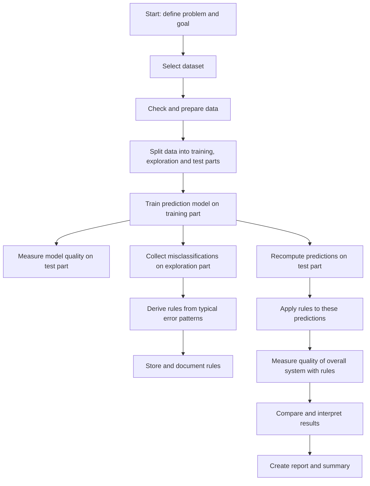
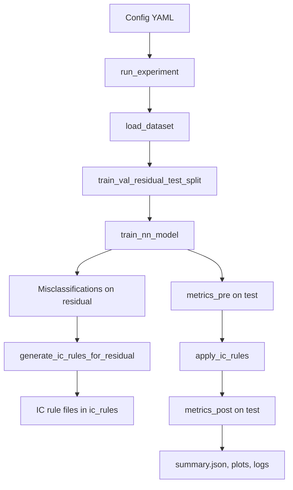
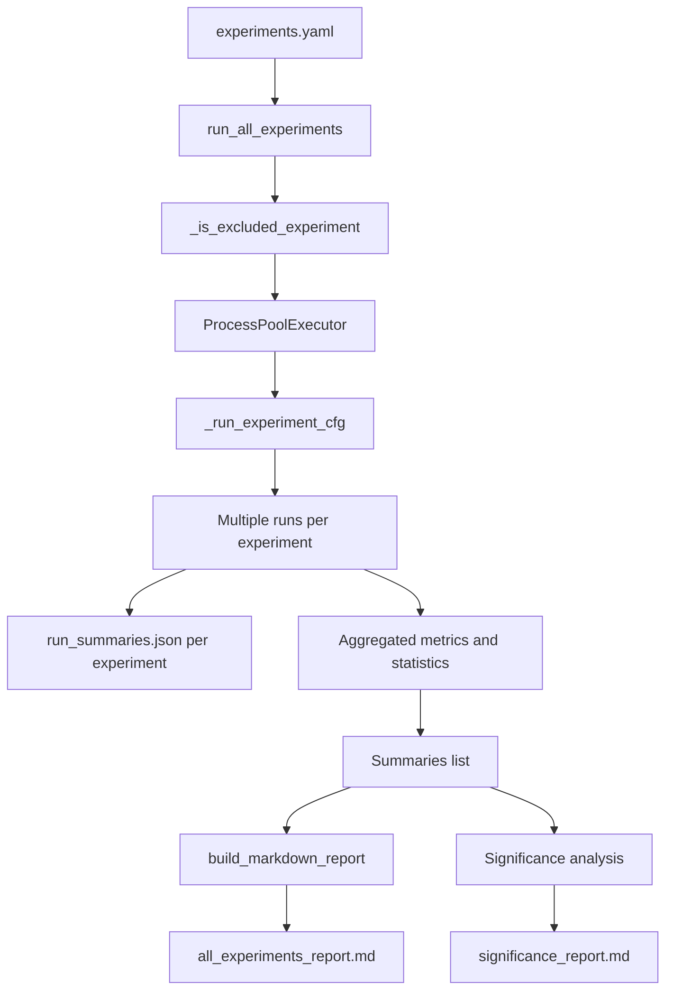
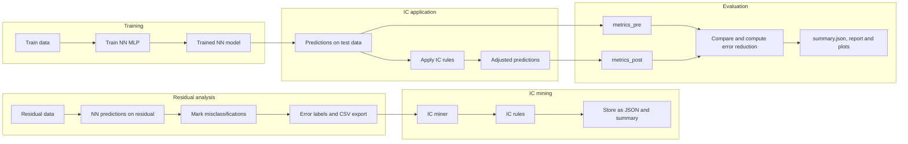

# NNIC Eval – Neural Networks with Integrity Constraints

This repository contains a reference implementation of **NNIC (Neural Networks with Integrity Constraints)** for evaluating integrity-constraint-enhanced neural networks on various classification datasets.

The code covers the complete workflow:

- **Load and split data** into `train`, `residual`, `test` (optionally `val`).
- **Train a neural network (MLP)** as base model.
- **Identify misclassifications** and mine **integrity constraint rules (ICs)** from these errors.
- **Apply IC rules** to flag or correct NN predictions.
- **Evaluate** (pre/post IC metrics, error rates, "Green AI"-like indicators, baseline comparisons).
- **Run batch experiments** over many datasets and splits, including Markdown report and simple significance analysis.

> This is the English README. For the original German version, see `README.md`.

---

## Contents

- [Requirements & Installation](#requirements--installation)
- [Project Structure](#project-structure)
- [Datasets Used](#datasets-used)
  - [Sklearn/UCI Datasets](#sklearnuci-datasets)
  - [OpenML Datasets](#openml-datasets)
- [Experiment Configuration](#experiment-configuration)
- [Process Overview](#process-overview)
  - [Business-level Overview (non-technical)](#business-level-overview-non-technical)
  - [High-level Pipeline (single experiment)](#high-level-pipeline-single-experiment)
  - [Batch Experiments & Reporting](#batch-experiments--reporting)
  - [Detailed IC Generation & Application](#detailed-ic-generation--application)
- [Outputs & Reports](#outputs--reports)
- [Reproducibility & Statistics](#reproducibility--statistics)

---

## Requirements & Installation

- Python (version as in `requirements.txt`, e.g. 3.10+)
- Virtual environment recommended

```bash
# (optional) create virtual environment
python -m venv .venv
source .venv/bin/activate  # on Windows: .venv\Scripts\activate

# install dependencies
pip install -r requirements.txt
```

---

## Project Structure

Important directories and files:

- **`src/nnic/`**  – main code
  - **`data/datasets.py`**  – dataset loading (sklearn & OpenML).
  - **`data/splitting.py`**  – creation of `train`, `residual`, `test` (and optional `val`) splits.
  - **`models/nn_models.py`**  – MLP architectures.
  - **`training/nn_trainer.py`**  – NN training incl. training history.
  - **`misclassification/`**  – extraction and export of misclassifications.
  - **`ic_generation/`**  – mining of IC rules (random forest / clustering) from error regions.
  - **`ic_application/`**  – application of IC rules (flagging vs. correction).
  - **`evaluation/metrics.py`**  – standard classification metrics.
  - **`baselines/rf_baseline.py`**  – random forest baseline.
  - **`experiment/runner.py`**  – executes a single experiment based on a config.
  - **`experiment/hpo.py`**  – grid search over hyperparameters (on validation metric).
  - **`experiment/utils.py`**  – seed handling, output directory preparation.
  - **`reporting/report_builder.py`**  – builds a Markdown report over all experiments.
- **`configs/`**  – YAML configurations
  - `experiments.yaml`  – master list of experiments (dataset, splits, model, IC settings, etc.).
  - additional example configs per dataset/split.
- **`run_experiment.py`**  – runs a single experiment (path to config as argument).
- **`run_all_experiments.py`**  – runs all experiments defined in `experiments.yaml` as a batch.
- **`start_nnic.sh`**  – convenience script to launch the batch experiments.
- **Result folders (created automatically):**
  - `results/`  – metrics, summaries, run statistics.
  - `plots/`  – plots for accuracy, errors, IC effect, tree visualisations.
  - `ic_rules/`  – JSON representation and textual summary of the generated IC rules.
  - `logs/`  – training histories, etc.

---

## Datasets Used

The datasets are loaded in `src/nnic/data/datasets.py` and configured per experiment in `configs/experiments.yaml`.

### Sklearn/UCI Datasets

These datasets are loaded directly via `sklearn.datasets`:

| Short name      | Source              | Task type                          | Comment |
|-----------------|---------------------|------------------------------------|---------|
| `digits`        | `load_digits()`     | multiclass classification (digits) | Handwritten digits (8x8 pixel grid as features). |
| `covertype`     | `fetch_covtype()`   | multiclass classification          | Forest cover types from geo-spatial features. |
| `iris`          | `load_iris()`       | multiclass classification          | 3 Iris species based on flower measurements. |
| `breast_cancer` | `load_breast_cancer()` | binary classification           | Diagnostic baseline (malignant vs. benign). |
| `wine`          | `load_wine()`       | multiclass classification          | Wine categories based on chemical features. |

For these datasets, the loader uses features `X` and labels `y` and normalises the labels to `0..(K-1)`.

Each dataset is used with three split schemes (see `experiments.yaml`):

- **95% train / 0% residual / 5% test**  (`test_size: 0.05`, `residual_size: 0.0`)
- **72.5% train / 22.5% residual / 5% test**  (`residual_size: 0.225`)
- **47.5% train / 47.5% residual / 5% test**  (`residual_size: 0.475`)

The test split (5%) is drawn with a fixed `random_state` and kept constant across experiments for a given dataset.

### Sklearn/UCI Dataset Characteristics (overview)

- **`digits`**  
  - Input features: greyscale pixel intensities of an 8x8 image grid (metric, continuous).  
  - Target: digit class {0, …, 9} (nominal, multiclass classification).
- **`covertype`**  
  - Input features: mix of continuous terrain features (elevation, slope, etc.) and encoded categorical attributes (soil type, wilderness area).  
  - Target: forest cover type (nominal, multiple classes).
- **`iris`**  
  - Input features: flower measurements (sepal and petal length/width; metric, continuous).  
  - Target: Iris species (nominal, three classes).
- **`breast_cancer`**  
  - Input features: numerical descriptors derived from image/tissue analysis (metric, continuous).  
  - Target: diagnosis benign vs. malignant (binary, nominal).
- **`wine`**  
  - Input features: chemical measurements (e.g. alcohol, acidity, minerals; metric, continuous).  
  - Target: wine category (nominal, multiclass).

### OpenML Datasets

For generic OpenML datasets, the loader uses `fetch_openml(..., as_frame=True)` followed by one-hot encoding of all categorical features and conversion to numeric columns.

`experiments.yaml` includes (among others) the following OpenML datasets (IDs according to OpenML):

| Name in report       | OpenML ID | Task type                   |
|----------------------|----------:|-----------------------------|
| `credit-g`           | 31        | credit risk (binary)        |
| `bank-marketing`     | 1461      | marketing response (binary) |
| `adult`              | 45068     | income classification       |
| `spambase`           | 44        | spam detection              |
| `phoneme`            | 1489      | phoneme classification      |
| `nomao`              | 1486      | binary classification       |
| `magic-telescope`    | 1120      | gamma telescope data        |
| `electricity`        | 151       | time-series classification  |

The split schemes correspond to the same 95/5, 72.5/22.5/5 and 47.5/47.5/5 scenarios as for the sklearn datasets.

### OpenML Dataset Characteristics (overview)

- **`credit-g` (31)**  
  - Input features: credit attributes such as duration, amount, employment length, payment behaviour (mixed scales: ordinal, nominal, metric).  
  - Target: creditworthiness (good vs. bad; binary, nominal).
- **`bank-marketing` (1461)**  
  - Input features: customer and campaign characteristics (age, job, contact channel, previous contacts, etc.; numeric and categorical).  
  - Target: response to a marketing campaign (yes/no; binary, nominal).
- **`adult` (45068)**  
  - Input features: socio-economic attributes (age, education, occupation, hours worked, marital status; numeric and categorical).  
  - Target: income class (>50K vs. ≤50K; binary, nominal).
- **`spambase` (44)**  
  - Input features: frequencies of specific tokens/characters in e-mails (mainly metric, continuous features).  
  - Target: spam vs. non-spam (binary, nominal).
- **`phoneme` (1489)**  
  - Input features: acoustic speech descriptors characterising phonemes (metric, continuous).  
  - Target: phoneme class (binary or multi-coded, nominal).
- **`nomao` (1486)**  
  - Input features: mix of numeric and categorical variables from a matching/decision setting.  
  - Target: binary decision class (nominal).
- **`magic-telescope` (1120)**  
  - Input features: physical measurements from a Cherenkov telescope (metric, continuous).  
  - Target: event class (signal vs. background; binary, nominal).
- **`electricity` (151)**  
  - Input features: time-series related variables of an electricity market (e.g. demand, price, direction; partly numeric, partly categorical).  
  - Target: class variable describing market/price direction (nominal).

#### Tabular overview (approx. size & number of features)

**Sklearn/UCI datasets**

| Dataset        | Samples (approx.) | Features | Feature types                       | Target                              |
|----------------|-------------------|----------|-------------------------------------|-------------------------------------|
| `digits`       | 1797              | 64       | metric, continuous                  | digit classes (10 classes)          |
| `covertype`    | 581012            | 54       | mixed (continuous, categorical)     | forest cover type (7 classes)       |
| `iris`         | 150               | 4        | metric, continuous                  | Iris species (3 classes)            |
| `breast_cancer`| 569               | 30       | metric, continuous                  | diagnosis (benign/malignant)        |
| `wine`         | 178               | 13       | metric, continuous                  | wine category (3 classes)           |

**OpenML datasets**

| Dataset           | OpenML ID | Samples (approx.) | Features | Feature types                       | Target                               |
|-------------------|----------:|-------------------|----------|-------------------------------------|--------------------------------------|
| `credit-g`        | 31        | 1000              | 20       | mixed (ordinal, nominal, metric)    | creditworthiness (good/bad)          |
| `bank-marketing`  | 1461      | 45211             | 17       | mixed (numeric, categorical)        | campaign response (yes/no)           |
| `adult`           | 45068     | 48842             | 14       | mixed (numeric, categorical)        | income class (>50K vs. ≤50K)         |
| `spambase`        | 44        | 4601              | 57       | metric, continuous                  | spam vs. non-spam                    |
| `phoneme`         | 1489      | 4509              | 5        | metric, continuous                  | phoneme class                        |
| `nomao`           | 1486      | 34465             | 118      | mixed (numeric, categorical)        | binary decision class                |
| `magic-telescope` | 1120      | 19020             | 10       | metric, continuous                  | event class (signal vs. background)  |
| `electricity`     | 151       | 45312             | 8        | mixed (numeric, categorical)        | market/price direction               |

---

## Experiment Configuration

Full experiment definitions are stored in `configs/experiments.yaml`. Each experiment includes among others:

- **`experiment_name`**  unique name, used for output directories.
- **`dataset`**  dataset selection and parameters (incl. `openml_id` for OpenML datasets).
- **`splits`**  specification of `test_size`, `residual_size`, optional `val_size`, plus `random_state` and `stratify`.
- **`model`**  MLP architecture (e.g. `hidden_layers`, `activation`, `dropout`).
- **`training`**  batch size, epochs, learning rate, weight decay, device.
- **`ic_generation`**  hyperparameters for IC mining (random forest / cluster-based).
- **`ic_application`**  mode (`flagging` vs. `correction`) and collision handling.
- **optional `baseline.rf`**  RF baseline on train/test.

Example call for a single experiment:

```bash
python run_experiment.py configs/example_experiment.yaml
```

Batch experiments (all configs defined in `experiments.yaml`) with multiple runs and reporting:

```bash
python run_all_experiments.py
# or the convenience script
./start_nnic.sh
```

---

## Process Overview

### Business-level Overview (non-technical)



### High-level Pipeline (single experiment)

The core process for a single experiment (one dataset, one split configuration, one NN setup) is as follows:



**Step explanation:**

- **Load config:** YAML config from `configs/` defines dataset, splits, model, IC settings, etc.
- **Load & split data:**
  - `train`  training the NN (and RF baseline, if enabled).
  - `residual`  analysing misclassifications and mining ICs.
  - `test`  final evaluation before/after IC application.
  - optional `val`  hyperparameter tuning / monitoring.
- **NN training:** MLP is trained on the training split; training history is stored in `logs/`.
- **Pre-IC evaluation (`metrics_pre`):** metrics of the NN on the test split without ICs.
- **Misclassifications & IC mining:**
  - misclassifications on the `residual` split are exported.
  - based on these, random forests or clustering detect high-error regions, which are encoded as IC rules.
- **IC application:**
  - mode `flagging`: flags uncertain regions without changing class predictions.
  - mode `correction`: overwrites NN predictions in regions where ICs fire.
- **Post-IC evaluation (`metrics_post`):** metrics of the combined NNIC system (NN + ICs) on the test split.

### Batch Experiments & Reporting

The batch process over many experiments is orchestrated by `run_all_experiments.py`. It runs each experiment configuration multiple times with different seeds, aggregates statistics and builds Markdown reports.



Key points:

- **Multiple runs (`n_runs`)** per experiment with deterministically derived seeds.
- **Preprocessing for statistics**:
  - means, standard deviations, 95% confidence intervals per metric.
  - simple paired t-statistics for accuracy comparison pre vs. post ICs.
- **Report builder** aggregates results across datasets and generates tables and plots.

### Detailed IC Generation & Application

The following zooms into the NNIC component and shows how misclassifications are turned into IC rules and then applied to new data.

**Steps (IC pipeline):**

1. **Trained NN and residual data**  
   - a trained MLP is available from the previous training step.  
   - the `residual` split contains data not used for training.
2. **Predictions on residual split**  
   - the NN is applied to `X_residual`.  
   - resulting `y_pred_residual` is compared to the true labels to find misclassifications.
3. **Extract and flag misclassifications**  
   - in `misclassification/extraction.py`, TP/TN/FP/FN are marked.  
   - misclassifications are exported (e.g. CSV in the `results/` folder).
4. **IC mining**  
   - from the error regions, IC candidates are extracted using IC miners:  
     - **RF miner (`miner="rf"`)**: random forest on error labels, rules from tree paths.  
     - **Cluster miner (`miner="cluster"`)**: clustering of error samples and bounding-box rules.  
   - each rule is encoded as a logical implication `IF (region) THEN (consequence)`.
5. **IC representation & persistence**  
   - IC rules are serialised to `ic_rules/<experiment_name>/ic_rules_residual.json`.  
   - a human-readable summary (e.g. `ic_rules_residual_summary.txt`) lists rules in IF-THEN form.
6. **IC application on test data**  
   - NN predictions are computed on the test split (`y_pred_test`).  
   - ICs are applied via `apply_ic_rules` with:  
     - **mode `flagging`**: flags uncertain regions.  
     - **mode `correction`**: overwrites predictions in regions where ICs fire.
7. **Evaluation**  
   - metrics **before** (`metrics_pre`) and **after** (`metrics_post`) IC application are computed.  
   - error rates, error reduction and IC statistics (#rules, flagging share) are stored in `summary.json` and the report.



---

## Outputs & Reports

For each experiment `<experiment_name>`, the following artefacts are produced (among others):

- **`results/<experiment_name>/summary.json`**
  - `metrics_pre`, `metrics_post` (test metrics without/with ICs).
  - optional `metrics_val` (validation metrics).
  - `split_counts`, `splits`, `seed`, `config_snapshot`.
  - `model_complexity` (e.g. parameter counts, FLOPs approximation, RF statistics for ICs).
  - `ic` (number of rules, flagging share, mode).
- **`results/<experiment_name>/run_summaries.json`** (batch mode only)  
  - list of all single-run summaries for significance analyses.
- **`ic_rules/<experiment_name>/ic_rules_residual.json`**  
  - serialised IC rules (atomic conditions, conjunctions/disjunctions, consequences).
- **`ic_rules/<experiment_name>/ic_rules_residual_summary.txt`**  
  - human-readable list of rules in IF-THEN form.
- **`plots/<experiment_name>/...`**  
  - training curves and further visualisations.
- **`plots/report/...`** (created by the report builder)  
  - accuracy pre/post line plots per dataset and train percentage.  
  - bar plots of error counts before/after IC application.  
  - scatter plots "#IC rules" vs. "Enh%".
- **`results/all_experiments_report.md`**  
  - central Markdown report over all relevant experiments.
- **`results/significance_report.md`** (if enabled)  
  - overview of statistical tests and significance assessments.

---

## Reproducibility & Statistics

- **Seeds & splits** are stored explicitly in the summaries; the test split is fixed for all split scenarios of a given dataset.
- **Configuration:** each summary includes a `config_snapshot` so experiments can be reconstructed exactly.
- **Multiple runs:** `run_all_experiments.py` runs experiments multiple times; raw summaries are stored in `run_summaries.json`.
- **Aggregated metrics & CIs:** for accuracy, precision, recall, F1, means, standard deviations and 95% confidence intervals are computed.
- **Significance assessment:** a simple paired t-statistic is provided for accuracy pre vs. post IC per experiment to judge robustness of improvements.
