# NNIC Batch Experiments Report

## Metriken

- **Acc pre / Acc post**: Testgenauigkeit des NN ohne bzw. mit NNIC (IC-Korrekturen).
- **ΔAcc**: Absolute Differenz `Acc post - Acc pre`.
- **Enh%**: Relative Verbesserung der Testgenauigkeit durch NNIC, `100 * (Acc post - Acc pre) / Acc pre`. Nur definiert, wenn `Acc pre > 0` und ICs angewendet wurden.
- **F1 pre / F1 post**: F1-Score vor bzw. nach Anwendung der ICs.
- **#IC rules**: Anzahl der generierten und angewendeten IC-Regeln.
- **frac flagged**: Anteil der Testbeispiele, bei denen mindestens eine IC gegriffen und die NN-Vorhersage geändert hat (Flagging/Correction-Rate).
- **Err pre / Err post / ErrRed%**: Fehleranzahl vor bzw. nach Anwendung der ICs sowie prozentuale Fehlerreduktion, `100 * (Err pre - Err post) / Err pre`.
- **Acc/F1 RF (optional)**: Genauigkeit und F1-Score eines Random-Forest-Baseline-Klassifikators (falls konfiguriert).

## Green-AI (potentieller Vorteil)

Die folgenden Experimente protokollieren unter anderem die Anzahl der NN-Parameter sowie die Trainings- und IC-Laufzeiten. Diese Größen sind Indikatoren für den Ressourcenverbrauch, stellen aber **keine direkten Energiewerte** dar. Aussagen zu Green-AI-Vorteilen von NNIC beziehen sich daher auf eine **potentielle** Reduktion von Rechenaufwand und Fehlerraten, nicht auf gemessene CO₂-Emissionen.

### Gesamtwirkung von NNIC (gewichtete Mittelwerte über alle Experimente mit ICs)

- **Acc pre (gewichtet, nur Experimente mit ICs)**: 0.635
- **Acc post (gewichtet, nur Experimente mit ICs)**: 0.817
- **ΔAcc (gewichtet)**: 0.181
- **Enh% (gewichtet)**: 28.54%
- **Anzahl Testbeispiele (nur Experimente mit ICs)**: 65640

### Vergleich: NNIC mit halber Trainingsbasis vs. 95%-Baseline (Mittelwerte über Runs)

In der folgenden Übersicht wird für ausgewählte Datensätze die Performance von NNIC mit halbierter Trainingsbasis (47.5% Train, 47.5% Residual, 5% Test; Kennzahl: `Acc post (mean)`) der reinen NN-Baseline mit 95% Trainingsdaten (95% Train, 0% Residual, 5% Test; Kennzahl: `Acc pre (mean)`) gegenübergestellt.

| Dataset          | NN-Baseline (95% Train, Acc pre mean) | NNIC (47.5/47.5, Acc post mean) | ΔAcc (NNIC - 95% NN) | Rel. ΔAcc vs. 95% NN |
|------------------|----------------------------------------|----------------------------------|----------------------|----------------------|
| covertype        |                                  0.753 |                            0.804 |                 +0.051 |                +6.7% |
| credit-g         |                                  0.692 |                            0.760 |                 +0.068 |                +9.8% |
| electricity      |                                  0.773 |                            0.871 |                 +0.098 |               +12.7% |
| magic-telescope  |                                  0.821 |                            0.913 |                 +0.092 |               +11.2% |
| phoneme          |                                  0.848 |                            0.908 |                 +0.060 |                +7.0% |
| spambase         |                                  0.876 |                            0.809 |                 -0.068 |                -7.7% |

## Dataset: covertype

| Train% | Residual% | Test% | Train_n | Residual_n | Test_n | Exp. Name | Acc pre | Acc post | ΔAcc | Enh% | Err pre | Err post | ErrRed% | F1 pre | F1 post | #IC rules | frac flagged | Acc RF | F1 RF |
|--------|-----------|-------|--------:|-----------:|-------:|-----------|--------:|---------:|-----:|------:|--------:|---------:|--------:|-------:|--------:|----------:|-------------:|-------:|------:|
| 47.500 | 47.500 | 5.000 | 275980 | 275981 | 29051 | covertype_47_47_5 | 0.494 | 0.838 | 0.344 | 69.491 | 14688 | 4707 | 67.953 | 0.425 | 0.787 | 10 | 0.482 | - | - |
| 72.500 | 22.500 | 5.000 | 421233 | 130728 | 29051 | covertype_72_22_5 | 0.740 | 0.770 | 0.030 | 3.996 | 7552 | 6693 | 11.374 | 0.728 | 0.756 | 2 | 0.076 | - | - |
| 95.000 | 0.000 | 5.000 | 551961 | 0 | 29051 | covertype_95_5 | 0.760 | - | - | - | 6976 | - | - | 0.749 | - | 0 | 0.000 | - | - |

### Mittelwerte über Runs (sofern n_runs > 1)

| Train% | Residual% | Test% | Train_n | Residual_n | Test_n | Exp. Name | Acc pre (mean) | Acc post (mean) | ΔAcc (mean) | Enh% (mean) | F1 pre (mean) | F1 post (mean) | #IC rules (mean) | frac flagged (mean) |
|--------|-----------|-------|--------:|-----------:|-------:|-----------|--------------:|----------------:|------------:|------------:|--------------:|---------------:|------------------:|--------------------:|
| 47.500 | 47.500 | 5.000 | 275980 | 275981 | 29051 | covertype_47_47_5 | 0.597 | 0.804 | 0.207 | 34.703 | 0.538 | 0.773 | 8.200 | 0.364 |
| 72.500 | 22.500 | 5.000 | 421233 | 130728 | 29051 | covertype_72_22_5 | 0.742 | 0.761 | 0.020 | 2.651 | 0.730 | 0.748 | 1.200 | 0.048 |
| 95.000 | 0.000 | 5.000 | 551961 | 0 | 29051 | covertype_95_5 | 0.753 | - | - | - | 0.743 | - | 0.000 | 0.000 |

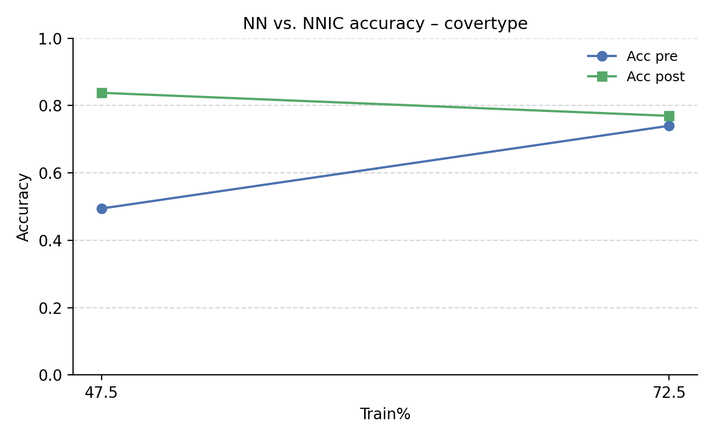

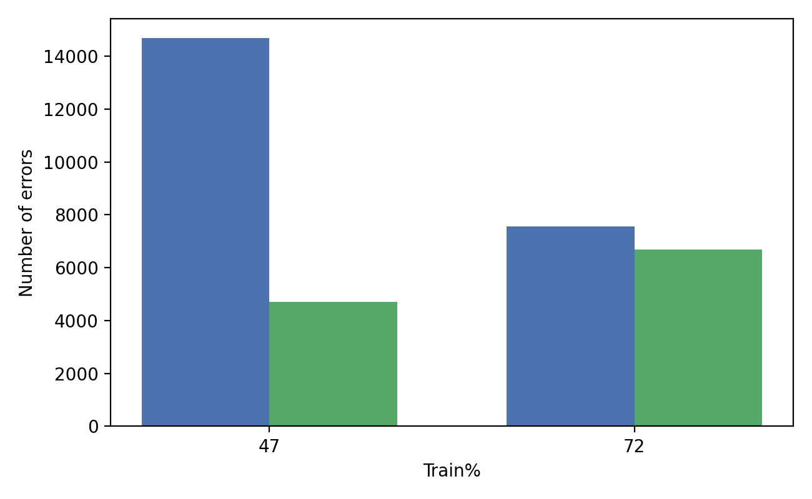

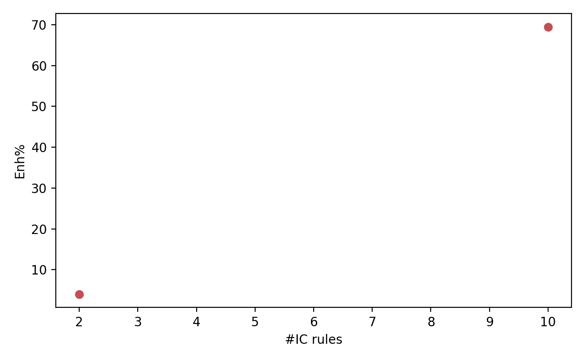

## Dataset: credit-g

| Train% | Residual% | Test% | Train_n | Residual_n | Test_n | Exp. Name | Acc pre | Acc post | ΔAcc | Enh% | Err pre | Err post | ErrRed% | F1 pre | F1 post | #IC rules | frac flagged | Acc RF | F1 RF |
|--------|-----------|-------|--------:|-----------:|-------:|-----------|--------:|---------:|-----:|------:|--------:|---------:|--------:|-------:|--------:|----------:|-------------:|-------:|------:|
| 47.500 | 47.500 | 5.000 | 475 | 475 | 50 | openml_creditg_47_47_5 | 0.700 | 0.800 | 0.100 | 14.286 | 15 | 10 | 33.333 | 0.576 | 0.762 | 7 | 0.100 | - | - |
| 72.500 | 22.500 | 5.000 | 725 | 225 | 50 | openml_creditg_72_22_5 | 0.700 | 0.760 | 0.060 | 8.571 | 15 | 12 | 20.000 | 0.576 | 0.698 | 3 | 0.060 | - | - |
| 95.000 | 0.000 | 5.000 | 950 | 0 | 50 | openml_creditg_95_5 | 0.700 | - | - | - | 15 | - | - | 0.576 | - | 0 | 0.000 | - | - |

### Mittelwerte über Runs (sofern n_runs > 1)

| Train% | Residual% | Test% | Train_n | Residual_n | Test_n | Exp. Name | Acc pre (mean) | Acc post (mean) | ΔAcc (mean) | Enh% (mean) | F1 pre (mean) | F1 post (mean) | #IC rules (mean) | frac flagged (mean) |
|--------|-----------|-------|--------:|-----------:|-------:|-----------|--------------:|----------------:|------------:|------------:|--------------:|---------------:|------------------:|--------------------:|
| 47.500 | 47.500 | 5.000 | 475 | 475 | 50 | openml_creditg_47_47_5 | 0.620 | 0.760 | 0.140 | 22.581 | 0.489 | 0.730 | 7.200 | 0.140 |
| 72.500 | 22.500 | 5.000 | 725 | 225 | 50 | openml_creditg_72_22_5 | 0.584 | 0.668 | 0.084 | 14.384 | 0.488 | 0.630 | 4.200 | 0.084 |
| 95.000 | 0.000 | 5.000 | 950 | 0 | 50 | openml_creditg_95_5 | 0.692 | - | - | - | 0.589 | - | 0.000 | 0.000 |

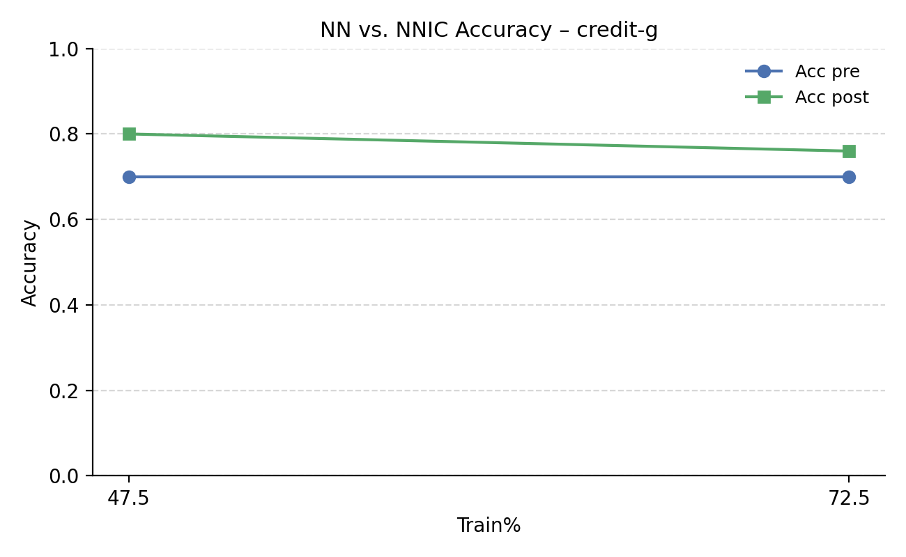

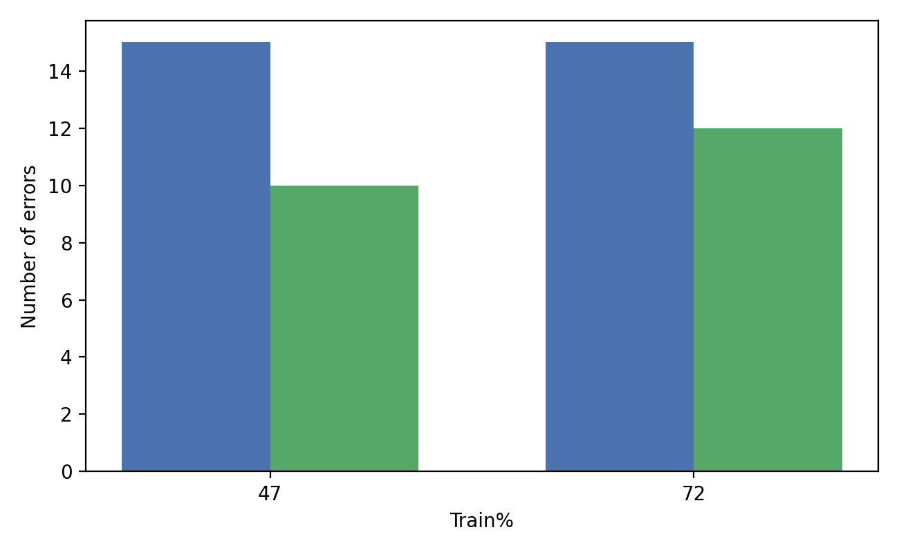

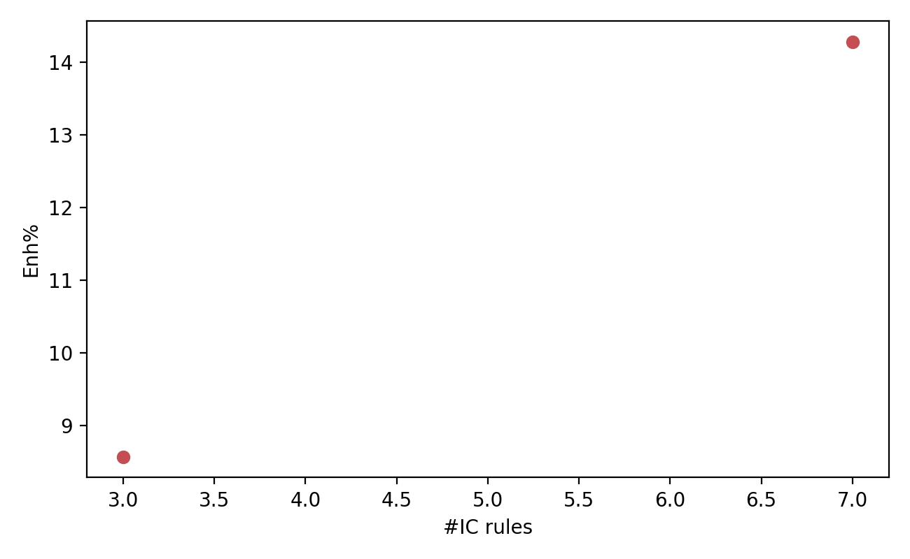

## Dataset: electricity

| Train% | Residual% | Test% | Train_n | Residual_n | Test_n | Exp. Name | Acc pre | Acc post | ΔAcc | Enh% | Err pre | Err post | ErrRed% | F1 pre | F1 post | #IC rules | frac flagged | Acc RF | F1 RF |
|--------|-----------|-------|--------:|-----------:|-------:|-----------|--------:|---------:|-----:|------:|--------:|---------:|--------:|-------:|--------:|----------:|-------------:|-------:|------:|
| 47.500 | 47.500 | 5.000 | 21523 | 21523 | 2266 | openml_electricity_47_47_5 | 0.735 | 0.918 | 0.183 | 24.910 | 600 | 185 | 69.167 | 0.727 | 0.919 | 9 | 0.261 | - | - |
| 72.500 | 22.500 | 5.000 | 32850 | 10196 | 2266 | openml_electricity_72_22_5 | 0.767 | 0.906 | 0.139 | 18.135 | 529 | 214 | 59.546 | 0.763 | 0.905 | 6 | 0.224 | - | - |
| 95.000 | 0.000 | 5.000 | 43046 | 0 | 2266 | openml_electricity_95_5 | 0.778 | - | - | - | 503 | - | - | 0.777 | - | 0 | 0.000 | - | - |

### Mittelwerte über Runs (sofern n_runs > 1)

| Train% | Residual% | Test% | Train_n | Residual_n | Test_n | Exp. Name | Acc pre (mean) | Acc post (mean) | ΔAcc (mean) | Enh% (mean) | F1 pre (mean) | F1 post (mean) | #IC rules (mean) | frac flagged (mean) |
|--------|-----------|-------|--------:|-----------:|-------:|-----------|--------------:|----------------:|------------:|------------:|--------------:|---------------:|------------------:|--------------------:|
| 47.500 | 47.500 | 5.000 | 21523 | 21523 | 2266 | openml_electricity_47_47_5 | 0.741 | 0.871 | 0.130 | 17.572 | 0.738 | 0.870 | 9.000 | 0.256 |
| 72.500 | 22.500 | 5.000 | 32850 | 10196 | 2266 | openml_electricity_72_22_5 | 0.767 | 0.889 | 0.122 | 15.934 | 0.765 | 0.889 | 5.800 | 0.225 |
| 95.000 | 0.000 | 5.000 | 43046 | 0 | 2266 | openml_electricity_95_5 | 0.773 | - | - | - | 0.771 | - | 0.000 | 0.000 |

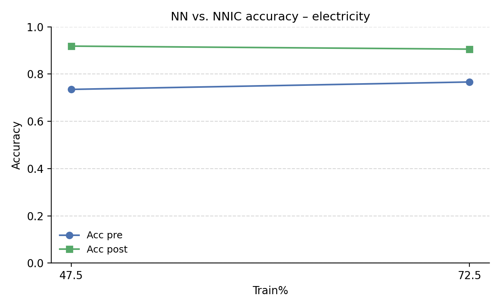

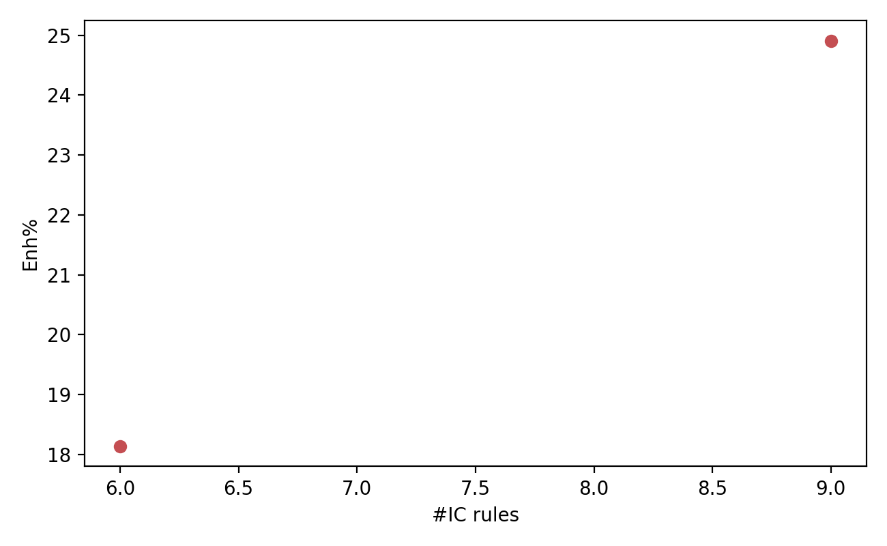

## Dataset: magic-telescope

| Train% | Residual% | Test% | Train_n | Residual_n | Test_n | Exp. Name | Acc pre | Acc post | ΔAcc | Enh% | Err pre | Err post | ErrRed% | F1 pre | F1 post | #IC rules | frac flagged | Acc RF | F1 RF |
|--------|-----------|-------|--------:|-----------:|-------:|-----------|--------:|---------:|-----:|------:|--------:|---------:|--------:|-------:|--------:|----------:|-------------:|-------:|------:|
| 47.500 | 47.500 | 5.000 | 9034 | 9035 | 951 | openml_magic_47_47_5 | 0.800 | 0.952 | 0.151 | 18.922 | 190 | 46 | 75.789 | 0.787 | 0.952 | 4 | 0.186 | - | - |
| 72.500 | 22.500 | 5.000 | 13789 | 4280 | 951 | openml_magic_72_22_5 | 0.810 | 0.953 | 0.143 | 17.662 | 181 | 45 | 75.138 | 0.797 | 0.953 | 7 | 0.168 | - | - |
| 95.000 | 0.000 | 5.000 | 18069 | 0 | 951 | openml_magic_95_5 | 0.832 | - | - | - | 160 | - | - | 0.825 | - | 0 | 0.000 | - | - |

### Mittelwerte über Runs (sofern n_runs > 1)

| Train% | Residual% | Test% | Train_n | Residual_n | Test_n | Exp. Name | Acc pre (mean) | Acc post (mean) | ΔAcc (mean) | Enh% (mean) | F1 pre (mean) | F1 post (mean) | #IC rules (mean) | frac flagged (mean) |
|--------|-----------|-------|--------:|-----------:|-------:|-----------|--------------:|----------------:|------------:|------------:|--------------:|---------------:|------------------:|--------------------:|
| 47.500 | 47.500 | 5.000 | 9034 | 9035 | 951 | openml_magic_47_47_5 | 0.792 | 0.913 | 0.121 | 15.329 | 0.780 | 0.909 | 4.200 | 0.193 |
| 72.500 | 22.500 | 5.000 | 13789 | 4280 | 951 | openml_magic_72_22_5 | 0.814 | 0.919 | 0.105 | 12.865 | 0.807 | 0.919 | 5.200 | 0.147 |
| 95.000 | 0.000 | 5.000 | 18069 | 0 | 951 | openml_magic_95_5 | 0.821 | - | - | - | 0.814 | - | 0.000 | 0.000 |

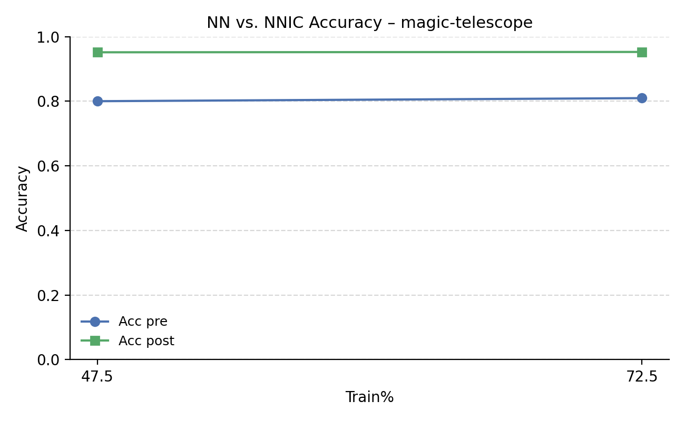

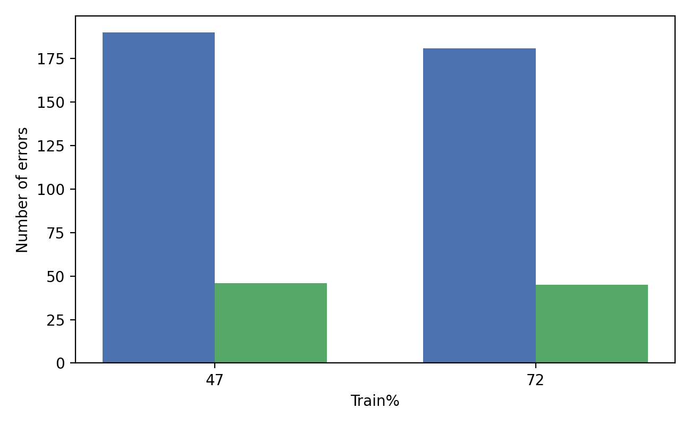

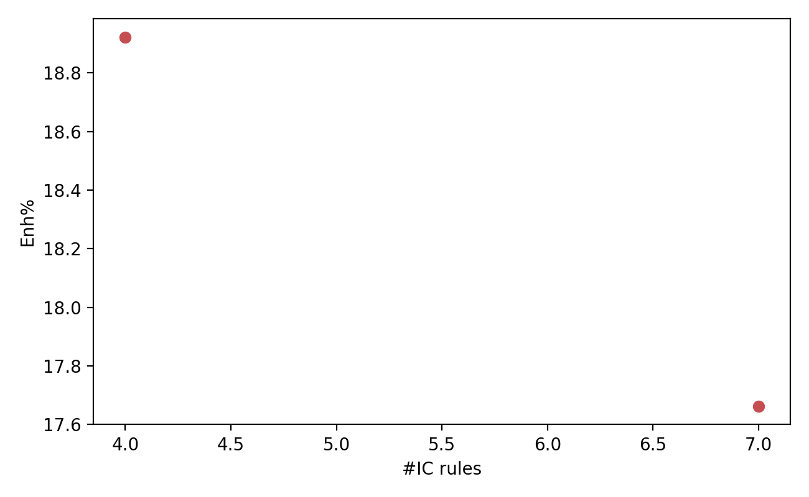

## Dataset: phoneme

| Train% | Residual% | Test% | Train_n | Residual_n | Test_n | Exp. Name | Acc pre | Acc post | ΔAcc | Enh% | Err pre | Err post | ErrRed% | F1 pre | F1 post | #IC rules | frac flagged | Acc RF | F1 RF |
|--------|-----------|-------|--------:|-----------:|-------:|-----------|--------:|---------:|-----:|------:|--------:|---------:|--------:|-------:|--------:|----------:|-------------:|-------:|------:|
| 47.500 | 47.500 | 5.000 | 2566 | 2567 | 271 | openml_phoneme_47_47_5 | 0.838 | 0.923 | 0.085 | 10.132 | 44 | 21 | 52.273 | 0.838 | 0.923 | 7 | 0.096 | - | - |
| 72.500 | 22.500 | 5.000 | 3917 | 1216 | 271 | openml_phoneme_72_22_5 | 0.852 | 0.904 | 0.052 | 6.061 | 40 | 26 | 35.000 | 0.851 | 0.904 | 9 | 0.077 | - | - |
| 95.000 | 0.000 | 5.000 | 5133 | 0 | 271 | openml_phoneme_95_5 | 0.860 | - | - | - | 38 | - | - | 0.862 | - | 0 | 0.000 | - | - |

### Mittelwerte über Runs (sofern n_runs > 1)

| Train% | Residual% | Test% | Train_n | Residual_n | Test_n | Exp. Name | Acc pre (mean) | Acc post (mean) | ΔAcc (mean) | Enh% (mean) | F1 pre (mean) | F1 post (mean) | #IC rules (mean) | frac flagged (mean) |
|--------|-----------|-------|--------:|-----------:|-------:|-----------|--------------:|----------------:|------------:|------------:|--------------:|---------------:|------------------:|--------------------:|
| 47.500 | 47.500 | 5.000 | 2566 | 2567 | 271 | openml_phoneme_47_47_5 | 0.827 | 0.908 | 0.081 | 9.821 | 0.826 | 0.908 | 7.600 | 0.103 |
| 72.500 | 22.500 | 5.000 | 3917 | 1216 | 271 | openml_phoneme_72_22_5 | 0.843 | 0.887 | 0.044 | 5.254 | 0.844 | 0.888 | 8.400 | 0.068 |
| 95.000 | 0.000 | 5.000 | 5133 | 0 | 271 | openml_phoneme_95_5 | 0.848 | - | - | - | 0.848 | - | 0.000 | 0.000 |

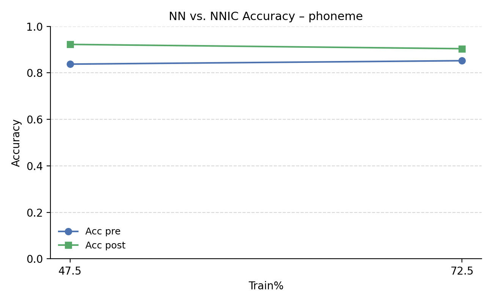

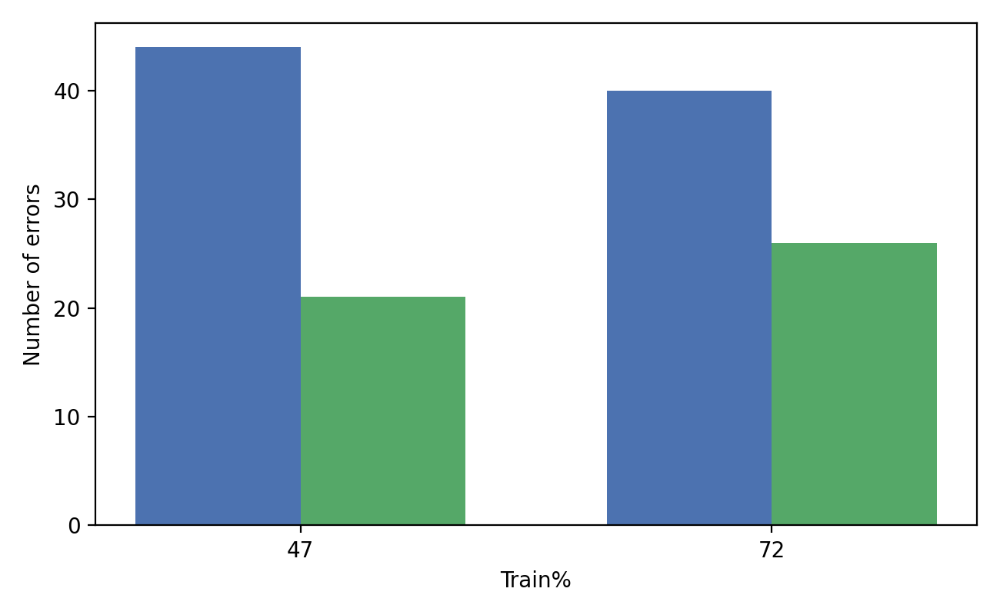

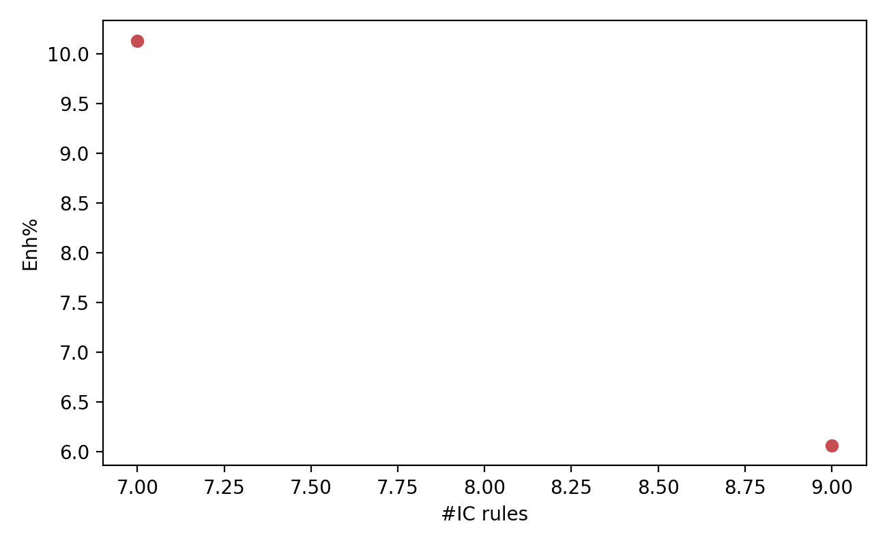

## Dataset: spambase

| Train% | Residual% | Test% | Train_n | Residual_n | Test_n | Exp. Name | Acc pre | Acc post | ΔAcc | Enh% | Err pre | Err post | ErrRed% | F1 pre | F1 post | #IC rules | frac flagged | Acc RF | F1 RF |
|--------|-----------|-------|--------:|-----------:|-------:|-----------|--------:|---------:|-----:|------:|--------:|---------:|--------:|-------:|--------:|----------:|-------------:|-------:|------:|
| 47.500 | 47.500 | 5.000 | 2185 | 2185 | 231 | openml_spambase_47_47_5 | 0.818 | 0.848 | 0.030 | 3.704 | 42 | 35 | 16.667 | 0.814 | 0.847 | 6 | 0.035 | - | - |
| 72.500 | 22.500 | 5.000 | 3335 | 1035 | 231 | openml_spambase_72_22_5 | 0.857 | 0.870 | 0.013 | 1.515 | 33 | 30 | 9.091 | 0.855 | 0.868 | 5 | 0.017 | - | - |
| 95.000 | 0.000 | 5.000 | 4370 | 0 | 231 | openml_spambase_95_5 | 0.896 | - | - | - | 24 | - | - | 0.897 | - | 0 | 0.000 | - | - |

### Mittelwerte über Runs (sofern n_runs > 1)

| Train% | Residual% | Test% | Train_n | Residual_n | Test_n | Exp. Name | Acc pre (mean) | Acc post (mean) | ΔAcc (mean) | Enh% (mean) | F1 pre (mean) | F1 post (mean) | #IC rules (mean) | frac flagged (mean) |
|--------|-----------|-------|--------:|-----------:|-------:|-----------|--------------:|----------------:|------------:|------------:|--------------:|---------------:|------------------:|--------------------:|
| 47.500 | 47.500 | 5.000 | 2185 | 2185 | 231 | openml_spambase_47_47_5 | 0.787 | 0.809 | 0.022 | 2.750 | 0.776 | 0.801 | 6.000 | 0.023 |
| 72.500 | 22.500 | 5.000 | 3335 | 1035 | 231 | openml_spambase_72_22_5 | 0.835 | 0.840 | 0.004 | 0.518 | 0.834 | 0.838 | 4.600 | 0.007 |
| 95.000 | 0.000 | 5.000 | 4370 | 0 | 231 | openml_spambase_95_5 | 0.876 | - | - | - | 0.877 | - | 0.000 | 0.000 |

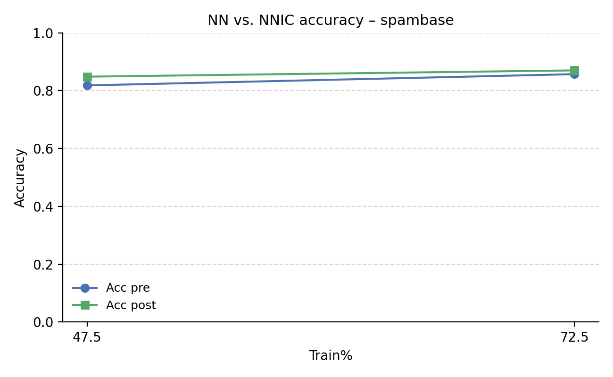

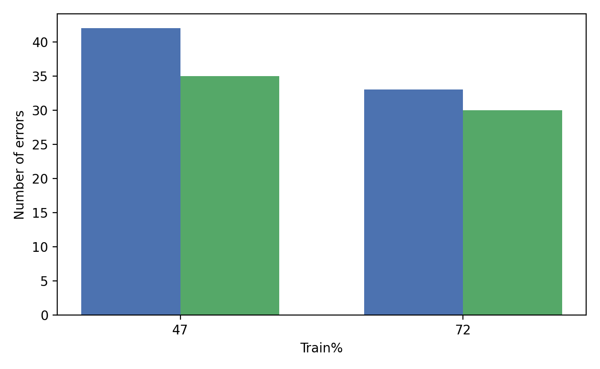

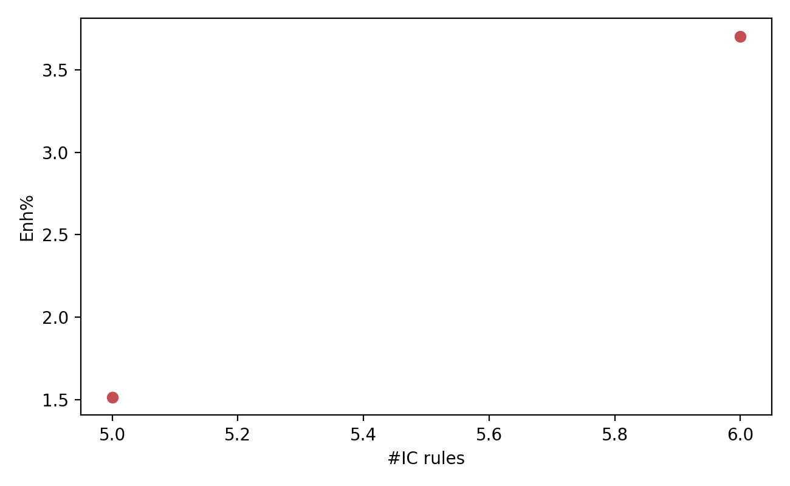

